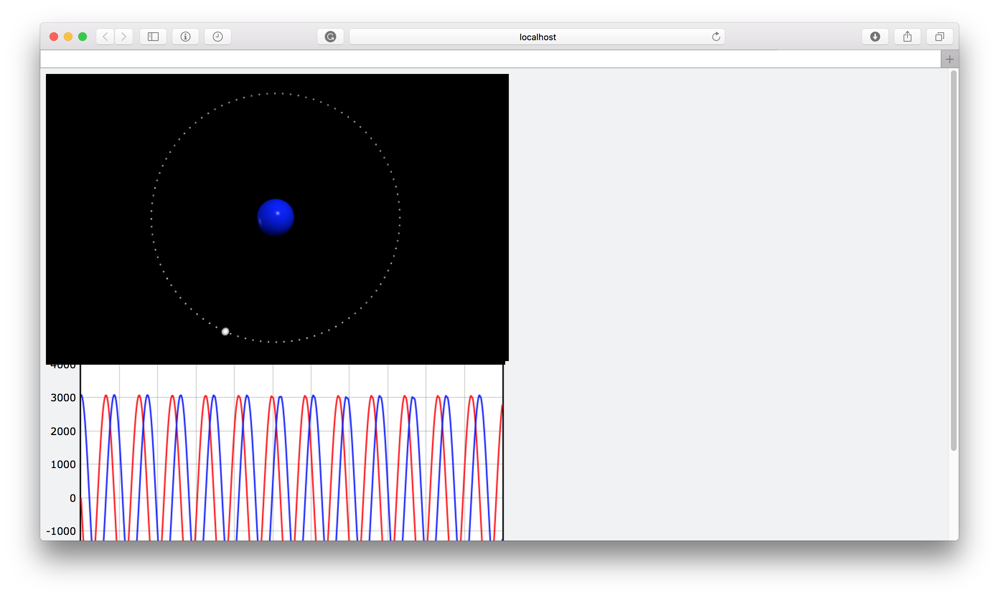
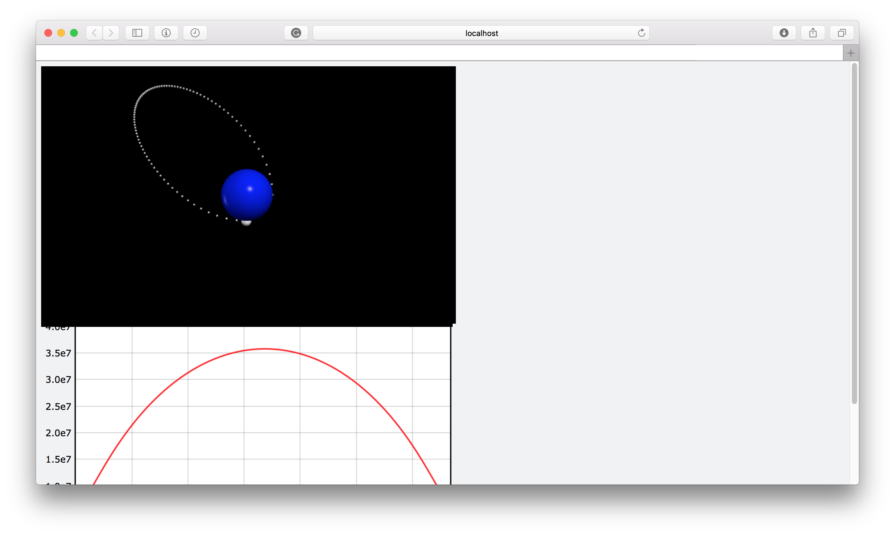
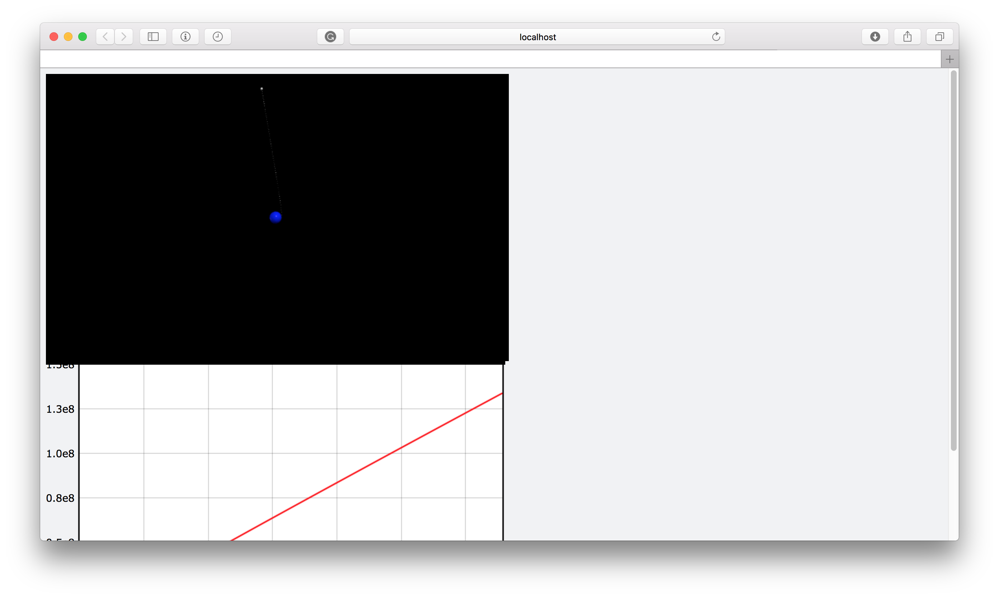
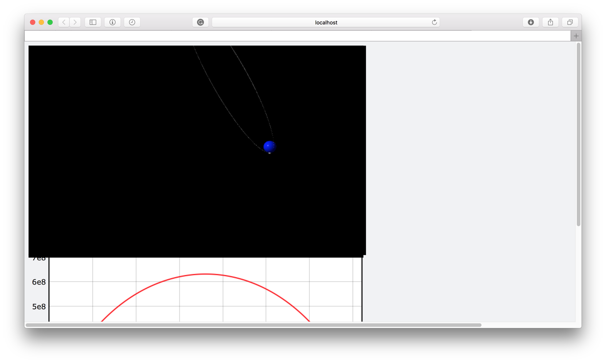

# Rocket_Launch/Orbit
 Physics simulations proof of concept for orbiting and escape velocity
# Requirements
* Vpython: https://vpython.org
# Preview
Orbit  

Failed Escape from Earth's Gravity 

Successful Escape from Earth's Gravity 

Larger Failed Escape from Earth's Gravity  

